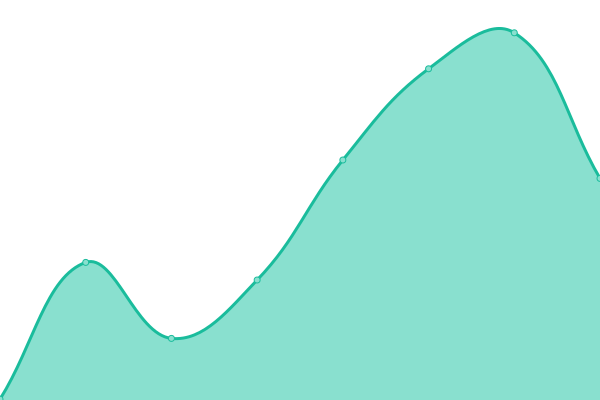

# [📈 Live Status](https://MaximizeLLC.github.io/Katniss-Status): <!--live status--> **🟧 Partial outage**

This repository contains the open-source uptime monitor and status page for [MaximizeLLC](https://MaximizeLLC.github.io/Katniss-Status), powered by [Upptime](https://github.com/upptime/upptime).

With [Upptime](https://upptime.js.org), you can get your own unlimited and free uptime monitor and status page, powered entirely by a GitHub repository. We use [Issues](https://github.com/MaximizeLLC/Katniss-Status/issues) as incident reports, [Actions](https://github.com/MaximizeLLC/Katniss-Status/actions) as uptime monitors, and [Pages](https://MaximizeLLC.github.io/Katniss-Status) for the status page.

<!--start: status pages-->
<!-- This summary is generated by Upptime (https://github.com/upptime/upptime) -->
<!-- Do not edit this manually, your changes will be overwritten -->
<!-- prettier-ignore -->
| URL | Status | History | Response Time | Uptime |
| --- | ------ | ------- | ------------- | ------ |
|  [Katniss (Glitch | Code)](https://glitch.com/edit/#!/katniss) | 🟩 Up | [katniss-glitch-code.yml](https://github.com/MaximizeLLC/Katniss-Status/commits/HEAD/history/katniss-glitch-code.yml) | 

 160ms
     
 | 

<a href="https://MaximizeLLC.github.io/Katniss-Status/history/katniss-glitch-code">100.00%</a>
    

|  [Katniss (Glitch | App)](https://katniss.glitch.me) | 🟥 Down | [katniss-glitch-app.yml](https://github.com/MaximizeLLC/Katniss-Status/commits/HEAD/history/katniss-glitch-app.yml) | 

 279ms
     
 | 

<a href="https://MaximizeLLC.github.io/Katniss-Status/history/katniss-glitch-app">0.00%</a>
    

|  [Katniss (Replit | Code)](https://replit.com/@maximize/Katniss) | 🟥 Down | [katniss-replit-code.yml](https://github.com/MaximizeLLC/Katniss-Status/commits/HEAD/history/katniss-replit-code.yml) | 

 175ms
     
 | 

<a href="https://MaximizeLLC.github.io/Katniss-Status/history/katniss-replit-code">0.00%</a>
    

|  [Katniss (Replit | App)](https://katniss.maximize.repl.co/) | 🟥 Down | [katniss-replit-app.yml](https://github.com/MaximizeLLC/Katniss-Status/commits/HEAD/history/katniss-replit-app.yml) | 

 0ms
     
 | 

<a href="https://MaximizeLLC.github.io/Katniss-Status/history/katniss-replit-app">0.00%</a>
    

<!--end: status pages-->

[**Visit our status website →**](https://MaximizeLLC.github.io/Katniss-Status)

## 📄 License

- Powered by: [Upptime](https://github.com/upptime/upptime)
- Code: [MIT](./LICENSE) © [MaximizeLLC](https://MaximizeLLC.github.io/Katniss-Status)
- Data in the `./history` directory: [Open Database License](https://opendatacommons.org/licenses/odbl/1-0/)
